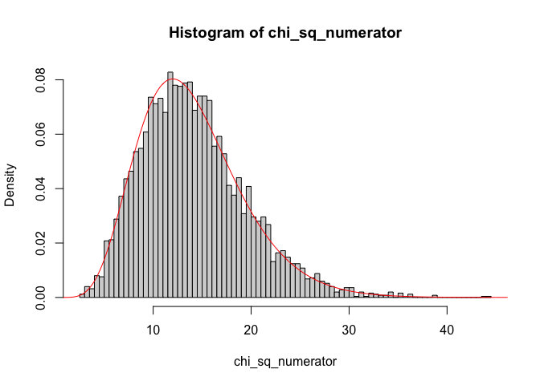
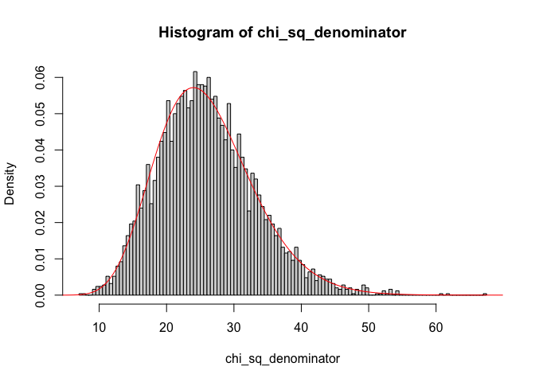
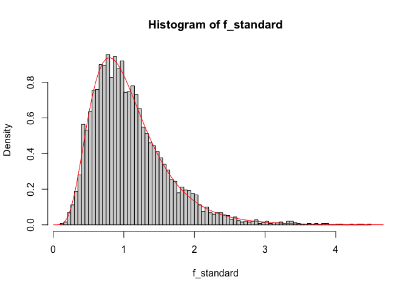
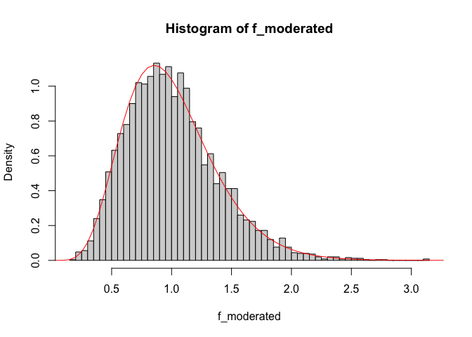
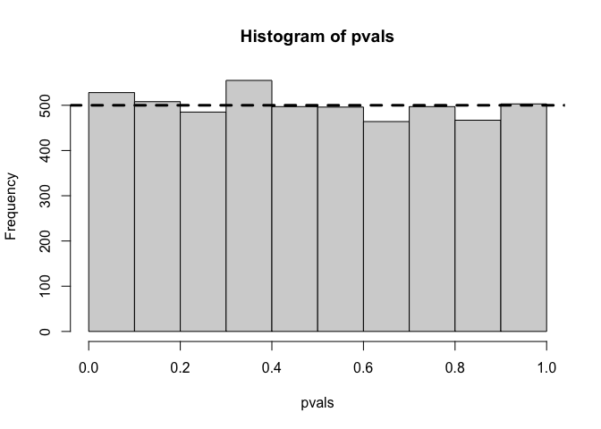

Using limma::squeezeVar() to moderate *F*-statistics
================

We start by loading the `limma` library:

``` r
library(limma)
```

Then, we define some arbitrary values for our degrees of freedom, sample
sizes and values used for plotting.

``` r
df_1 <-  14
df_2 <- 26
n <- 5000
xg <- seq(0, 120, by = 0.05)
```

Next, we generate random  distributed data with the above
choosen degrees of freedom.

``` r
set.seed(12)
chi_sq_numerator <- rchisq(n, df = df_1)
chi_sq_denominator <- rchisq(n, df = df_2)
```

To check that we actually got  distributed data with the
respective degrees of freedom, we check their distributions.

``` r
hist(chi_sq_numerator, breaks = 100, probability = TRUE)
lines(xg, dchisq(xg, df = df_1), col = "red")
```

<!-- -->

``` r
hist(chi_sq_denominator, breaks = 100, probability = TRUE)
lines(xg, dchisq(xg, df = df_2), col = "red")
```

<!-- --> Now, we
compute our *F*-statistics with
:

``` r
f_standard <- (chi_sq_numerator/df_1)/(chi_sq_denominator/df_2)
```

and inspect if our data is distributed as expected:

``` r
hist(f_standard, breaks = 100, probability = TRUE)
lines(xg, df(xg, df1 = df_1, df2 = df_2), col = "red")
```

<!-- -->

Now, we would like to obtain more precise estimators
 for our true
 and ultimately obtain a
partially moderated *F*-statistic. To achieve that, we phrase our
problem as a Bayesian estimation of the variance of a Normal
distribution around a known mean and use all observed variances
 to shrink individual estimates  towards
. In order to do so, we assume that the true
 follows a scaled inverse  distribution, or if we
consider :
 Using Bayes’
theorem it can be derived that the posterior mean
 of this model can be computed with
.

The hyperparameters  and  can be computed by fitting
 as a scaled *F*-distriubtion with
. Details on the parameter estimation
are described by Smyth et al. (2004) and implemented within the `limma`
R package in the function `squeezeVar()`.

We perform the above described moderation by calling
`limma::squeezeVar()`:

``` r
chi_sq_denominator_squeezeVar <- squeezeVar(chi_sq_denominator/df_2, df = df_2)
df_0 <- chi_sq_denominator_squeezeVar$df.prior
squeezed_chi_sq_denominator <- chi_sq_denominator_squeezeVar$var.post
```

Since our estimated  is already scaled by its
posterior degrees of freedom , our
moderated *F*-statistic is computed by 

``` r
f_moderated <- (chi_sq_numerator/df_1)/(squeezed_chi_sq_denominator)
```

We inspect our moderated $F$ distribution

``` r
hist(f_moderated, breaks = 100, probability = TRUE)
lines(xg, df(xg, df1 = df_1, df2 = df_0 + df_2), col = "red")
```

<!-- --> If we were to
obtain $p$-values now, these would be distributed as follows:

``` r
pvals <- 1 - pf(f_moderated, df1 = df_1, df2 = df_0 + df_2)
hist(pvals, breaks = 12)
abline(h = n/10, col="black", lwd=3, lty=2)
```

<!-- -->

``` r
sessionInfo()
```

    ## R version 4.0.0 Patched (2020-05-04 r78358)
    ## Platform: x86_64-apple-darwin17.0 (64-bit)
    ## Running under: macOS Mojave 10.14.6
    ## 
    ## Matrix products: default
    ## BLAS:   /Library/Frameworks/R.framework/Versions/4.0/Resources/lib/libRblas.dylib
    ## LAPACK: /Library/Frameworks/R.framework/Versions/4.0/Resources/lib/libRlapack.dylib
    ## 
    ## locale:
    ## [1] en_US.UTF-8/en_US.UTF-8/en_US.UTF-8/C/en_US.UTF-8/en_US.UTF-8
    ## 
    ## attached base packages:
    ## [1] stats     graphics  grDevices utils     datasets  methods   base     
    ## 
    ## other attached packages:
    ## [1] limma_3.44.1
    ## 
    ## loaded via a namespace (and not attached):
    ##  [1] compiler_4.0.0  magrittr_1.5    tools_4.0.0     htmltools_0.5.0
    ##  [5] yaml_2.2.1      stringi_1.4.6   rmarkdown_2.2   knitr_1.28     
    ##  [9] stringr_1.4.0   xfun_0.14       digest_0.6.25   rlang_0.4.6    
    ## [13] evaluate_0.14
